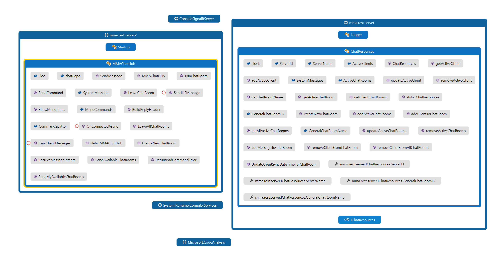
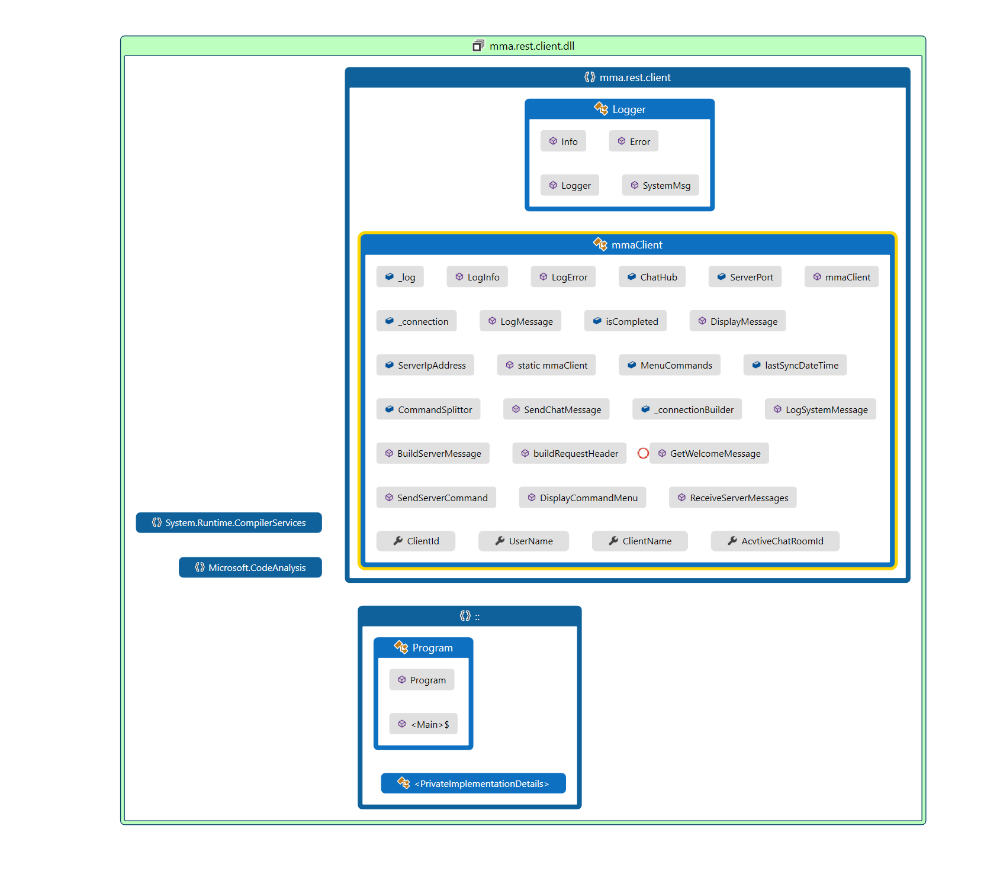

# MMA Chat Program (REST/SignalR)

### Overview

This implementation for MMA chat app built using  REST\SignalR asp.net framework to communicate between the server and client

### Architecture

#### Server Class Diagram

#### Client Class Diagram

