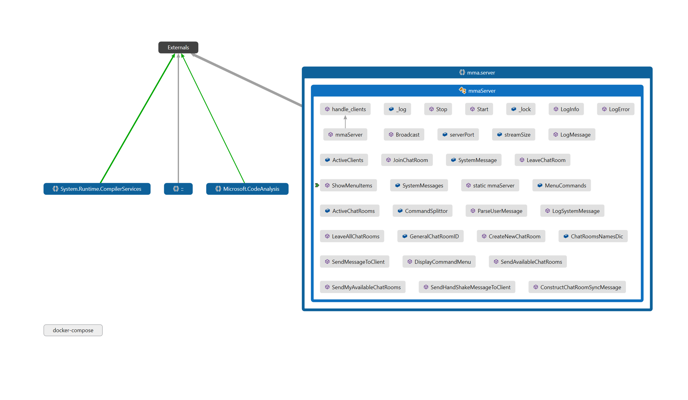
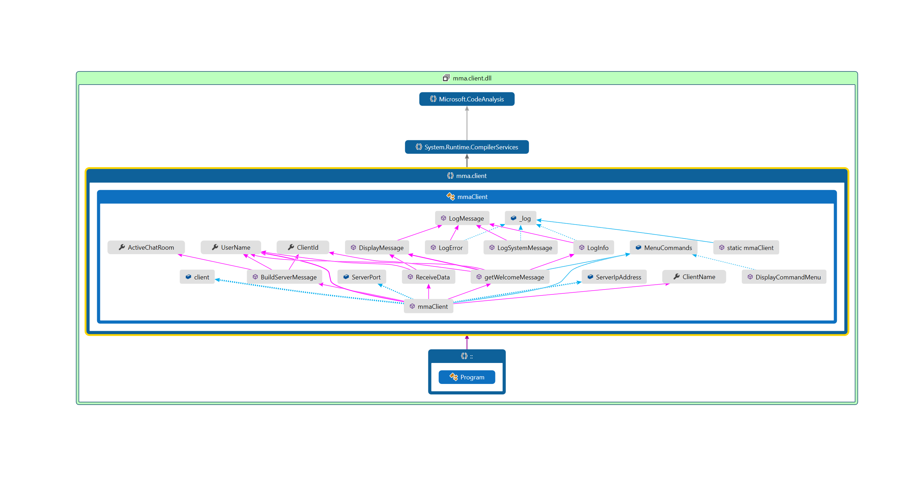

# MMA Chat Program (Socket)

### Overview

This implementation for MMA chat app built to use socket communication to communicate between the server and client

### Architecture

#### Server Class Diagram

#### Client Class Diagram

